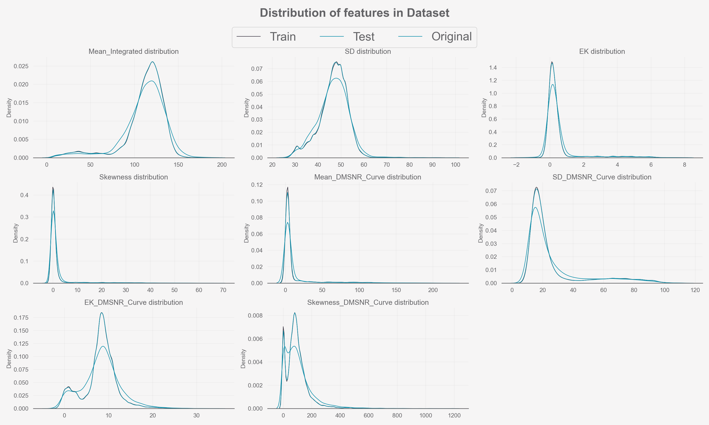

# TPS S3E10 <!-- omit in toc -->
## Nonlinearity <!-- omit in toc -->

## Table of Contents <!-- omit in toc -->

- [Overview](#overview)
- [Exploratory Data Analysis](#exploratory-data-analysis)
- [Modelling](#modelling)
  - [Baseline](#baseline)
  - [Other Models](#other-models)
  - [Final Model](#final-model)
- [Conclusion](#conclusion)

## Overview

This is the 6th place solution for [episode 10 of the third season of the Tabular Playground Series](https://www.kaggle.com/competitions/playground-series-s3e10/overview). The dataset this round had 118_000 observations and 9 features synthesized from pulsar observations. The goal was binary classification to predict if an observation was a pulsar, with log loss as the evaluation metric. The TPS competitions often have smaller datasets than their monetary cousins to make it more accessible, particularly towards newcomers as tabular data is easier to handle than a large image dataset for example. That said, there is also some sort of theme or challenge unique to the competition which competitors must figure out. The challenge to hurdle in this episode was nonlinearity between the features and target. To try and lessen the affect of confident wrong predictions being penalized by log loss, my final model was an ensemble of a few different types of models: Generalized Additive Model and a couple forest models.

## Exploratory Data Analysis

Since we are allowed to use the original data if we want to, one of the first things investigated was if the two datasets were similar enough. As we can see in 

the synthetic data is nearly identical whilst the original is different. Other Kagglers performed Adversarial Validation to double check if the original was different enough to dump and the results were in agreement. There also appears to be an errata: the Skewness and Kurtosis features are mixed up. Skewness is centered close around 0 while Kurtosis is usually a larger positive number. In 

[the features by class distribution](data/images/features_vs_class_dist.png)

there is a stark contrast how the target behaves. Some features the two classes are roughly similar and dense while others the positive class is easily distinguishable by how flat dissimilar it is from the negative. There were some very long tails which present the opportunity to log transform some features. Class imbalance was present at 90% to 10% negative and positive classes, respectively. As seen in the following pie chart:

There were also some strong [correlations](data/images/plot_heatmap_Train Correlation.png) among the features as well as the target. Applying polynomial expansion and feature selection might be worthwhile. Lastly, the data's dimensions were reduced by PCA, TSNE and UMAP to [visualize in 3D](notebooks/1.EDA.ipynb#3d-visualization) which showed mostly separated classes with only a few of each class throughout the other. This should make it fairly easy to get a decent score, but much harder to get a good one.

## Modelling

### Baseline

Random Forest models are often a good choice for a baseline because the don't need as much data prep prior to use, often yield good results and you can extract value information from them in the form of feature importance. Calibration of the model was done to try and relieve the harsh negative penalty from confident incorrect answers due to log loss but was futile. As predicted from the EDA, the log loss score was surprisingly good - just 0.00151 high than my final public leaderboard score (0.03269 vs. 0.03118).

### Other Models

Pycaret was used to test a plethora of other models and preprocessing steps with high throughput. Mainly of interest for preprocessing were the interaction and transformation steps, polynomial with interaction, trigonometric and ratios were all tried in different permutations and different feature selection thresholds. The great thing about Pycaret is that it allows you to compare a multitude of models at the same time then choose individual models to continue with model development. Unfortunately, these experiments were done in the cloud and there was an error merging it with git. An assortment of other methods were carried out as well like pseudo-labelling & clustering, predictions after dimensionality reduction, very wide multilayer perceptrons, anomaly detection and KNN.

Generalized Additive Models (GAM) were the clincher in this competition. [Patrick Blackwill](https://www.kaggle.com/paddykb) posted his [notebook](https://www.kaggle.com/code/paddykb/ps-s3e10-gam-finger-on-the-pulsarrrrr) in R, which shot to first place. Unfortunately, the python package for GAMs (PyGAM) is missing a key feature - tensor interactions - which improves the R version by a good margin. Regardless, it still performed better than the forest models.

### Final Model

The final model was an ensemble of the best performing GAM, forests and the same forests but resgressors instead of classifiers. The ensemble was weighted soft voting where the weights were chosen by an educated guess based on how well they performed on the leaderboard. This guess turned out to be almost the best choice of weights where adjusting most of them, either up or down, would decrease the public leaderboard score.

## Conclusion

As usual, this competition was fun yet extremely frustrating - you can try everything you can think of and go nowhere. I added an assortment of new techniques to my library for next time. Pycaret may be quick and easy to use while being very customisable, but it is just not *quite* customisable enough. A few of the top submissions had a similar idea to implement feature interactions and polynomial transformations. They had more control of how they were selected afterwords (permutation selection) instead of whatever Pycaret does and the we can see what a difference that made. Optuna was also essentially a waste of time, all it did was overfit the already probably overfit forest models to the leader board. Placing 6th place was very rewarding though, I have been working tireless for months now without going that great. Now, It feels good all that work has been paying off. Time for the next one!
